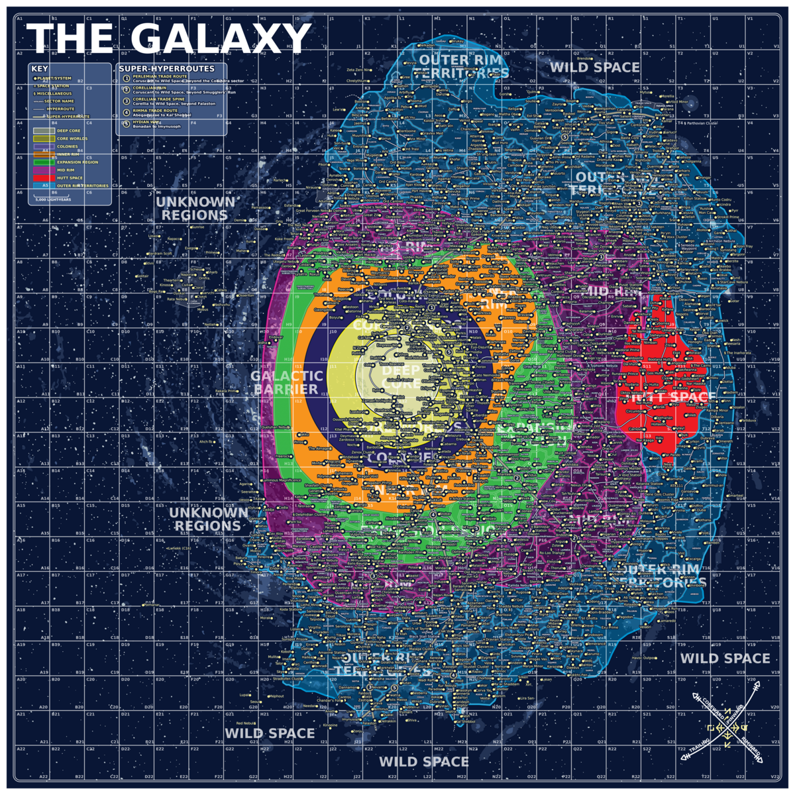

# Interactive Galactic Atlas

A bilingual, browser-based Star Wars galaxy map for finding locations, inspecting cartographic data, and calculating hyperspace routes.

The atlas combines a high-resolution 4,320 × 4,320 map with a searchable catalog of 2,731 planets, systems, stations, and other points of interest. It runs entirely in the browser and can be hosted by any static web server.



## Features

- Search 2,731 named locations and select them directly on the map.
- Pan, zoom, reset the view, or jump to exact pixel coordinates.
- Filter locations by galactic region and object type.
- Toggle the grid, hyperroutes, regions, sectors, and dynamic location layer independently.
- Distinguish planets and systems (`●`), space stations (`¤`), and miscellaneous objects (`§`).
- Display location names and symbols dynamically so the visible marker and its interactive coordinates always match.
- Show selected locations with an animated yellow halo and full-map crosshair.
- Link duplicate appearances in the main map and the Arkanis, Javin, and Kessel inset maps.
- Open location details and Wookieepedia summaries without leaving the atlas.
- Switch the complete interface between Spanish and English; the preference is saved locally.
- Use the route planner on desktop, tablet, or mobile.

## Route planner

The planner connects every cataloged location to a navigable graph built from 60 named hyperroutes. It uses Dijkstra's algorithm to find the lowest-cost path, preferring recorded hyperroute segments over local links and transfers between otherwise disconnected route networks.

For every leg, the result includes:

- the origin and destination;
- the named hyperroute or auxiliary link;
- distance in parsecs and light-years; and
- estimated travel time for hyperdrive classes 0.5 through 5.

The selected route is drawn over the map. Recorded hyperroute segments use a solid red line, while local links and transfers use a dashed amber line. When both endpoints also appear in an inset, the route is repeated inside that inset rather than drawing an incorrect line between the two map representations.

### Distance and travel-time model

The estimator uses the Standard Galactic Grid as its scale:

- 1 grid square = 1,500 parsecs
- 1 parsec = 3.26 light-years
- travel time = base time × hyperdrive class

| Segment type | Base time per grid square |
| --- | ---: |
| Major hyperroute | 8 hours |
| Ordinary hyperroute or local link | 16 hours |
| Outer Rim, Wild Space, Unknown Regions, or uncharted space | 24 hours |
| Deep Core | 24–48 hours |

These figures are fictional planning estimates for this map, not canon travel times.

## How it is built

The application deliberately uses a small, dependency-free front end:

- **HTML** provides the bilingual interface, filters, dialogs, and accessible controls.
- **CSS** handles the responsive desktop/mobile layout and visual styling.
- **Vanilla JavaScript modules** manage state, search, interaction, routing, translations, and Wookieepedia requests.
- **Canvas 2D** composites the map and renders dynamic markers, labels, crosshairs, selected routes, and inset copies.
- **Node.js build scripts** merge the source catalogs, normalize coordinates, build the route graph, and generate the files consumed by the browser.

The map is assembled in this order:

1. Fixed galactic background
2. Regions
3. Grid
4. Sectors
5. Hyperroutes
6. Inset-map background and dynamic locations
7. Selected route and locator graphics
8. Fixed legend, always drawn above every other layer

Locations are not baked into a single raster image. Their marker, label, color, hit area, and map occurrences all come from the same generated record. This avoids visible/interactable coordinate mismatches and lets filters work without regenerating the artwork.

## Data pipeline

`npm run build` performs the following steps:

1. Reads the supplementary location catalog, extracted SVG records, and hyperroute definitions.
2. Matches map labels and aliases while preserving separate main-map and inset occurrences.
3. Assigns the correct marker type and galactic-region color.
4. Connects consecutive stops on each named hyperroute.
5. Adds clearly identified, higher-cost local links and inter-network transfers so every location remains reachable.
6. Writes `dist/data/map-data.json` for the application and `dist/data/galactic-locations.csv` for inspection or reuse.

The validation script checks dataset size, unique IDs, extracted coordinates, category symbols, bilingual coverage, layer wiring, graph connectivity, inset links, and the distance/time formulas.

## Project structure

| Path | Purpose |
| --- | --- |
| `public/` | Static application source and 4,320 × 4,320 map layers |
| `public/index.html` | Interface structure and dialogs |
| `public/styles.css` | Responsive layout and styling |
| `public/app.js` | Map rendering, search, filters, routing, translations, and Wookieepedia integration |
| `public/route-math.js` | Distance and travel-time rules |
| `scripts/build-data.mjs` | Catalog merge, coordinate normalization, and route-graph generation |
| `scripts/validate-data.mjs` | Data, UI, graph, and calculation checks |
| `source-planets.csv` | Supplementary location catalog |
| `source-svg-catalog.json` | Locations and label geometry extracted from the SVG map |
| `source-hyperlanes.json` | Ordered named-hyperroute stops |
| `dist/` | Complete deployable static website generated by the build |

## Run locally

The generated site has no server-side component. It must be opened through HTTP rather than directly as a `file://` page because the browser loads the generated catalog with `fetch()`.

### Use the existing build

Serve the `dist` directory with any static web server. For example, with Python:

```bash
python -m http.server 8000 --directory dist
```

Then open [http://localhost:8000](http://localhost:8000).

For XAMPP, copy the contents of `dist` into a folder such as `htdocs/MapaEspacial`, start Apache, and open `http://localhost/MapaEspacial/`.

### Rebuild the data

Node.js 18 or newer is recommended. The project has no third-party npm dependencies.

```bash
npm run build
npm test
```

After the build, serve `dist` using either of the methods above.

## Cartography and data credits

- Base map and visual layers by **Shane Sw5W** ([@StarWars5W](https://twitter.com/StarWars5W)).
- Supplementary location and route data derived from [Wason1797/StarWarsMap](https://github.com/Wason1797/StarWarsMap).
- Application and data-integration work by **@Bextia**, 2026. Contact: [galaxymap.4u515@aleeas.com](mailto:galaxymap.4u515@aleeas.com).

This is an unofficial, fan-made project and is not affiliated with or endorsed by Lucasfilm Ltd. or The Walt Disney Company.
